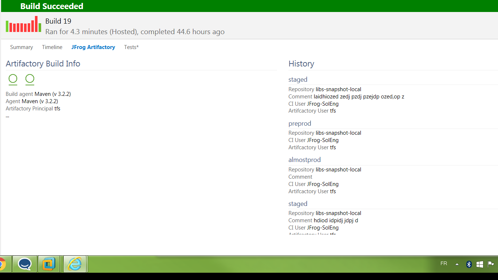

## Deprecation Notice
This extension has been deprecated and is no longer maintaned.
To continue using Artifactory with VSTS, we recommend using the new JFrog Artifactory Extension.
Get the new extension [here](https://marketplace.visualstudio.com/items?itemName=JFrog.jfrog-artifactory-vsts-extension).
To facilitate switching from the old extension to the new one, both extensions can be installed and run concurrently in your VSTS environment.

  
JFrog Artifactory, Universal Artifact Repository, offers advanced artifact management for .NET  development on Visual Studio Team Services with NuGet, Maven, and any other package format.

[Learn more](https://www.jfrog.com/artifactory)

## Manage your VSTS builds through Artifactory
Setup, configure, and access Artifactory directly from VSTS.

#### Fully traceable builds
Easily navigate between VSTS and Artifactory’s exhaustive build information for fully traceable builds.

#### Release Management
Promote your artifacts in Artifactory, through the development pipeline. directly from VSTS

## Deploy Any Artifact
Use the custom JFrog Artifactory Deployer task with the JFrog CLI to deploy any artifact during a build process

